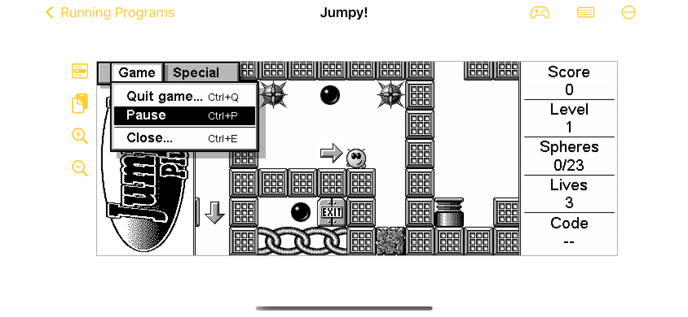
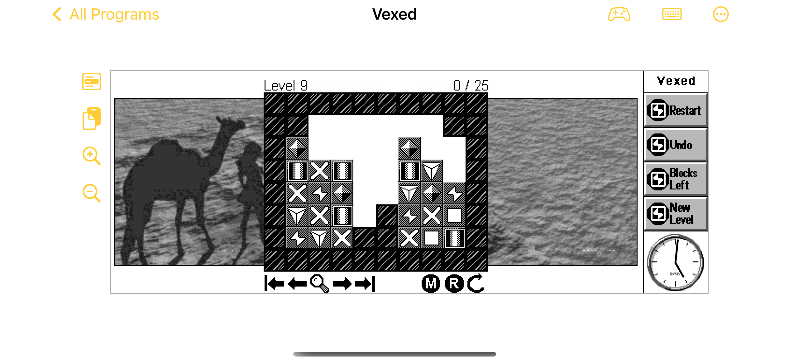

# OpoLua

[](https://github.com/inseven/opolua/actions/workflows/build.yaml)

An OPO (compiled OPL) interpreter written in Lua and Swift, based on the Psion Series 5 era format (ie ER5, prior to the Quartz 6.x changes). It lets you run Psion 5 programs written in OPL on any iOS device, subject to the limitations described below.

Supported features:

* Ability to directly install .SIS files, no need to extract them first
* Colour graphics (if the program originally provided them)
* Sound
* Limited game controller support - although a paired bluetooth keyboard is necessary for some programs that rely on the keyboard rather than touchscreen input.

One thing that is explicitly not supported is programs that aren't pure OPL - ie that are native ARM-format binaries. This project is an OPL interpreter only, it is not a full ARM virtual machine.

## Screenshots

Some example OPL programs downloaded from the internet, running in OpoLua on iOS:






## QCode

_Disclaimer: My understanding only, based on reading the opl-dev source code._

The OPL bytecode format is called QCode (for some reason). It is a simple stack machine with variable length commands. Each command consists of an 8-bit opcode followed by variable length parameters. A command like "AddInt" is a single 8-bit opcode, which pops 2 values from the stack and pushes 1 result. The OPO file format defines a collection of procedures with metadata (such as number of arguments, required local variable stack frame size, etc) for each plus the QCode itself.

An "application" is an OPO file called "X.app" alongside a file "X.aif" (Application Info Format) describing the app's icons and localised name.

There are something like 280 defined opcodes, plus another 128 or so "functions" invoked with the `CallFunction` opcode. The distinction between dedicated opcode and function code appears entirely arbitrary as there are some extremely complex "opcodes" and some fairly basic functions codes. Opcodes whose numerical value doesn't fit in a single byte are expressed as opcode 255 ("NextOpcodeTable") followed by a second byte being the real code minus 256. There are no opcodes requiring more than 2 bytes to express.

Strings are limited to a maximum length of 255 bytes (this was increased in Quartz, as well as making strings support UCS-2). Various other internal data structures were increased from 1 byte to 2 at the same time. Strings not part of a string array have a maxlength byte preceding the length byte - string addresses always point to the length byte. String arrays have a single maxlength byte common to all elements, immediately preceding the first string element. For this reason opcodes that operate on strings take an explicit max length parameter on the stack, since it is not possible to know a string's max length based solely on its address (you need to know whether it's in an array or not, and if so where the start of the array is).

Arrays are limited to 32767 elements (signed 16-bit) although the overall local variable size of a function is also limited to something like 16KB. The array length is stored in the 2 bytes immediately preceding the first element (in the case of number arrays) or preceding the max length byte (in the case of string arrays). Array size is statically fixed at the point of declaration and cannot be changed at runtime. Array addresses always point to the start of the first element. Arrays are not first-class values (you cannot pass an array to a proc, or assign one array to another) but some commands do accept array parameters.

## Implementation notes

This interpreter largely ignores types and specific memory layout restrictions. The stack is represented with a simple Lua table containing Lua number or string values, with no strict distinction between words/longs/floats.

Right now it runs in minimal Lua 5.3 or 5.4 with bare bones I/O support (on any OS), or as a iOS Swift app with fairly comprehensive graphics support (which uses Lua 5.4).

Variables (ie, values not on the stack) are represented by a table of metatable type `Variable`. Calling `var()` gets the value, and calling `var(newVal)` sets it. In the case of array values, `Variable` also supports array indexing. Each item in the array is itself a `Variable`. To assign to the first item in an array variable, do `arrayVar[1](newVal)`.

In OpoLua v1.0 variables were represented solely by Lua data structures using `Variable` and a complex mapping and pseudo-allocator was maintained to support APIs like `ADDR()` and `PEEKB()`. In v1.1 this was rewritten (and simplified) so that all `Variables` are backed by a contiguous address space represented by `Chunk`, which allows more accurate emulation of things like out-of-bounds memory accesses which are technically undefined but many programs relied on how these behaved on real hardware. `Chunk` uses an array of Lua integers to represent the raw memory values, 4 bytes per integer. This allows the interpreter to function in pure-Lua mode while (in principle) allowing a more optimised native backing store.

This interpreter is not 100% behaviour compatible with the original Psion. The more relaxed typing will mean that code which errored on a Psion may execute fine on here. Equally, programs relying on undefined behaviour (like writing to freed memory, or abuse of the asynchronous APIs) may not run correctly. Any non-UB non-erroring program (which also doesn't rely on expecting errors to occur and trapping them) should run OK here. Except for...

**This is a work in progress!** See the next section for missing features.

## Missing features

* Ability to load psion-format database files
* Various other less-common opcodes, functions and OPXes
* Some dialog features like dTIME, dFILE
* Invert drawing mode
* Ability to suspend/resume app execution in the iOS UI

## Example

[simple.txt](examples/simple.txt) compiled on a Psion Series 5:

```
$ cd src
$ ./runopo.lua ../examples/simple.opo
Hello world!
Waaaat

$ ./dumpopo.lua ../examples/simple.opo --all
Source name: D:\Program
procTableIdx: 0x0000006B
1: TEST @ 0x0000001F code=0x00000036 line=0
    Subproc "WAT" offset=0x0012 nargs=0
    iTotalTableSize: 5 (0x00000005)
00000036: 2B [ConstantString] "Hello world!"
00000044: 8B [PrintString]
00000045: 92 [PrintCarriageReturn]
00000046: 53 [RunProcedure] 0x0012 (name="WAT" nargs=0)
00000049: 82 [DropFloat]
0000004A: 57 [CallFunction] 0x0A (Get)
0000004C: 80 [DropInt]
0000004D: 76 [ZeroReturnFloat]
2: WAT @ 0x0000004E code=0x00000060 line=6
    iTotalTableSize: 0 (0x00000000)
00000060: 2B [ConstantString] "Waaaat"
00000068: 8B [PrintString]
00000069: 92 [PrintCarriageReturn]
0000006A: 76 [ZeroReturnFloat]
$
```

## References

Various useful resources which aided greatly in reverse-engineering the OPL and EPOC environments:

* https://github.com/opl-dev/opl-dev
* https://web.archive.org/web/20070716134804/http://3lib.ukonline.co.uk/progindex.htm
* https://web.archive.org/web/20060505220702/http://www.allaboutopl.com/wiki/OPLCommandsListing?v=kbu
* https://thoukydides.github.io/riscos-psifs/sis.html
* http://www.koeniglich.de/epoc32_fileformats.txt
* https://frodo.looijaard.name/psifiles/MBM_File
* http://www.davros.org/psion/psionics/
* http://www.users.globalnet.co.uk/~datajam/opl-manual/html/opl/opchapt13.html

## Contributing

We invite and welcome contributions! There's a pretty comprehensive list of [issues](https://github.com/inseven/opolua/issues) to get you started, and our documentation is always in need of some care and attention.

Please recognise opolua is a labour of love, and be respectful of others in your communications. We will not accept racism, sexism, or any form of discrimination in our community.

## Licensing

opolua is licensed under the MIT License (see [LICENSE](LICENSE)).
